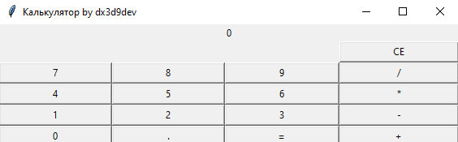

**Calculator Tkinter GUI**

**Author:** @ArchieWh1te

**Language:** Python 3.9

**Library:** tkinter, decimal

**License:** Free

### Обычный калькулятор с интерфейсом Tkinter

Запускаем файл *newcalculator.py*

